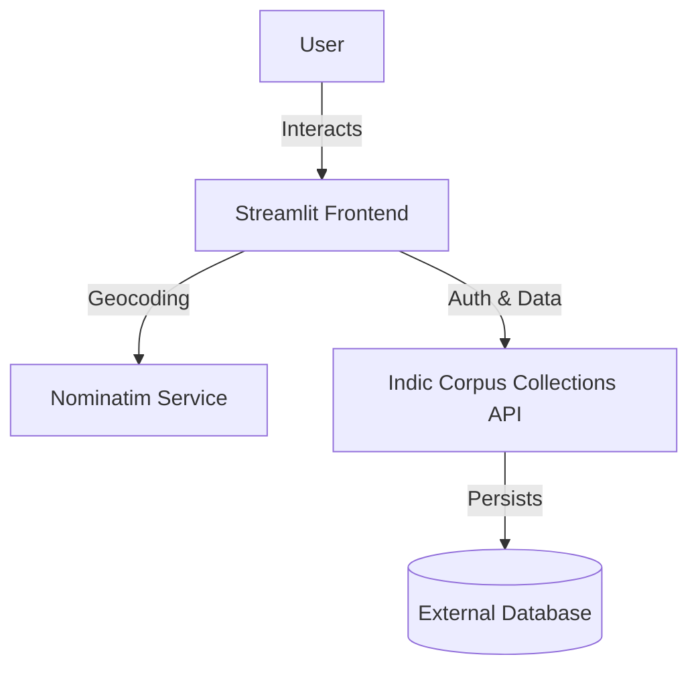

# Architecture Documentation

## System Overview

The **Desi Dialect Map** is designed as a stateless, thin-client application built with Streamlit. It serves as a frontend interface for the **Indic Corpus Collections API**, which handles all business logic, authentication, and data persistence.

## Module Responsibilities

### Core Application
-   **`app.py`**: The application entry point. Orchestrates the UI layout, manages global session state, and routes control to specific modules based on user interaction (Map, Gallery, Upload).

### API Layer (`api_*.py`)
These modules act as a Data Access Layer (DAL), abstracting HTTP requests to the external API.
-   **`api_auth.py`**: Handles low-level authentication logic (Login, Signup, OTP verification). Manages the HTTP session and Bearer token injection.
-   **`api_auth_ui.py`**: Contains the UI components for authentication forms (Login/Signup tabs) and manages the auth flow within the Streamlit sidebar.
-   **`api_records.py`**: Manages CRUD operations for dialect records. Handles image encoding/decoding and communicates with the `/records` endpoints.
-   **`api_categories.py`**: Fetches and caches category metadata to populate UI dropdowns.

### Components & Utilities
-   **`components/records_display.py`**: Reusable UI logic for rendering record grids and galleries.
-   **`config/settings.py`**: Centralized configuration for environment variables, API base URLs, and file validation rules (size, formats).

## Data Flow

### 1. User Authentication
1.  User submits credentials via `api_auth_ui.py`.
2.  `api_auth.py` sends a request to the API's auth endpoints.
3.  On success, the returned **Bearer Token** is stored in Streamlit's `st.session_state`.
4.  Subsequent requests in the session inject this token into the `Authorization` header.

### 2. Record Submission
1.  User uploads an image and enters text in `app.py`.
2.  **Geocoding**: The location string is sent to the Nominatim service via `geopy` to resolve `(lat, lon)`.
3.  Image data is converted to bytes.
4.  `api_records.py` constructs a multipart/form-data request and POSTs it to the API.

### 3. Data Visualization (Map & Gallery)
1.  `app.py` requests records via `api_records.py`.
2.  The API returns a JSON list of records containing metadata and image references.
3.  **Map**: `folium` renders markers using the `(lat, lon)` data.
4.  **Gallery**: Images are fetched lazily or in batches (depending on API implementation) and rendered using `st.image`.

## Key Architectural Decisions & Trade-offs

### Streamlit Framework
-   **Decision**: Use Streamlit for the frontend.
-   **Rationale**: Enables rapid development of data-heavy visualizations (Maps, Charts) with minimal frontend boilerplate.
-   **Trade-off**: Limited control over fine-grained DOM elements and styling. UI interactions trigger full script reruns, which can impact performance.

### Stateless Frontend (API-First)
-   **Decision**: No local database; strict dependency on the external API.
-   **Rationale**: Decouples the frontend from data management, allowing the backend to scale independently and serve multiple clients. Simplifies deployment (no stateful volumes needed).
-   **Trade-off**: The application has **zero offline functionality**. If the external API is unreachable, the application enters a degraded "Demo Mode" or fails.

### Synchronous Geocoding
-   **Decision**: Perform geocoding during the submission process.
-   **Rationale**: Ensures data quality by validating the location before storage.
-   **Trade-off**: Adds latency to the submission process. Dependency on the third-party Nominatim service introduces rate limits and potential failure points.

### In-Memory Session Management
-   **Decision**: Store authentication tokens in `st.session_state`.
-   **Rationale**: Simple to implement and secure against XSS (as opposed to `localStorage` in pure JS apps), as the state is server-side (relative to the Streamlit runner).
-   **Trade-off**: Session persistence is volatile. Refreshing the browser clears the session, requiring the user to log in again.
